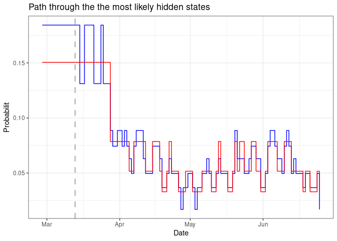

Registrated cases per day
================

## The model used.

The early stage of an outbreak can be described by the infectiousness of
the outbreak process, but in later stages of the outbreak, this is
complicated by factors such as changing contact patterns and the impact
of control measures. It is important to take these factors into account
in order to get a good, if approximate, model for an outbreak process.
For the covid-19 outbreak in the Netherlands, a non-homogeneous birth
process is used for the (quasi) reproductive power function, similar to
models in discrete survival analysis. A baseline reproductive power
function gives a description of the outbreak.

The non-homogeneous birth model (negative binomial) for outbreak data
depends on the reproductive power (probability) (“Modelling the
reproductive power function”, van den Broek, J., 2020, Journal of
Applied Statistics). This reproductive power is taken to be
non-homogeneous in order to deal with developments later on in the
outbreak. This non-homogeneous is important because, it allows the
(quasi) reproductive power to adapt to other dynamics besides the
infectious disease outbreak; dynamics such as changing contact patterns,
the changing population of susceptible individuals, and control measures
taken. Furthermore, in the case of a non-homogeneous reproductive power,
there is no need to include a homogeneous mixing assumption. This is
because such non-homogeneous mixing – for example if there are periods
in which the infected individuals mix well with other individuals and
periods in which this is less the case – can influence the number of
infected individuals at certain time points and the non-homogeneous
reproductive power can adapt to it. The model has the following
features:

  - The model is a non-homogeneous birth model so it can describe the
    early phase of the outbreak well and, due to its non-homogeneous
    nature, can deal with other aspects of the outbreak such as changing
    behavior or control measures taken besides.
  - It does not need the size of an at-risk population; such a
    population is often hard to determine and can change during the
    outbreak.
  - An infection is usually observed as having taken place in the past.
    This model deals with this in a way similar to current status data.
  - Because the model is a Markov model, it deals with dependence in the
    data.  
  - Modelling the log-odds of the reproductive power probabilities
    (proportion new cases of all the infections at any one time) is the
    same as modelling the log of the reproductive power (proportion of
    new cases per existing case).

\(R_p(t_{j})\) is the discrete quasi-reproductive power probability
function hereafter referred to as the reproductive power probability
function or shortly as the reproductive power probability. This is the
probability that an infection will occur at \(t_j\) given that it did
not occur before that point in time. Or the probability that an previous
infected individual will produce an infected at \(t_j\).

The conditional probability of observing \(z_{t_j}\) new infected
individuals at time \(t_j\) given \(y_{t_{j-1}}\) infected individuals
at the previous time point \(t_{j-1}\) is: 

The expected value is:

Taking a log link for the expected value of the number of new cases
(\(Z(t_j)\)), at time interval \(t_j\), given the total number of cases
in the previous interval, gives:

One can assume a parametric model for the survival function and use this
to calculate the reproductive power probability function, as was done in
(Van Den Broek, J. and Heesterbeek, J.A.P. (2007) “Non-Homogeneous Birth
and Death Models for Epidemic Outbreak Data”. Biostatistics8, 453-467)
with members from the Burr-family. To avoid this parametric assumption,
one can model the time effects with a piece wise constant function in
discrete time. \\  The log-odds of the reproductive probability can be
modelled linearly in the covariates. If the covariates all have baseline
values (usually zero), the model for the log-odds of the base line
reproductive probability, \(R_{p}(t_{j})\), is

so \(\alpha_{t_{j}}\) is the log-odds of the reproductive power
probability at time \(t_j\), and

# The data

The data is taken from the website of the RIVM:
<https://www.rivm.nl/coronavirus-covid-19/grafieken> The figure below
shows the daily number of registrated covid-19 cases from 2020/2/27
until 2020/6/8

<!-- -->

Note that the negative binomial distribution above, depends on the total
number of previous infected by conditioning on it: given the total
number of infected what is the probability of \(Z(t_j)\) new cases.
Because of this conditioning, the model is still valid if conditioning
is done on the number of previous infected individuals in a limited
amount of time. In this case fourteen days seems a reasonable time
window. The reproductive power function then shows the probability of a
newly infected individual on day \(t_j\) per infected in the last 14
days.

The estimated reproductive power function is:
<!-- -->

The beginning is quite messy since the conditioning is on less than 14
days. There is also a clear weekend effect as it is in the raw data. The
gray lines are 1000 parametric bootstrap lines to show the uncertainty.
There seems to roughly 4 periods: the first 30 days, between 30 an 60
days, between 60 and 80 days and the last approximately 3 weeks were the
reproductive power seem to rise again. This means that per infected
individual in the last 14 days the probability of producing an infected
is larger as compared to the period before that.

# An extension: A Markov-switching model

A hidden Markov process consists of two parts. The first is an
unobserved parameter process. So the reproductive power function might
change over time because the underlying probability goes through a
number of states. These states form a Markov model. So the state on
time-point t depends only on the previous time point. The transition
matrix determines the probability to go from one state to another.

The second part is the state-dependent part. Given the state it gives
the probability of observing a number of new cases. For more details see
( Zucchini w., Macdonald I.L. and Langrock R.(2016), “Hidden Markov
Models for TimeSeries. An Introduction Using R”. Second edition Boca
Raton: CRC Press).

The state dependent distribution is taken to be the above negative
binomial distribution which depends on the reproductive power
probability. Since this distribution also depends on the history in a
Markov way (it depends on the total number of infected in a previous
period), in this model there are 2 of these dependencies, one in the
state dependent distribution and one in the parameter process. Such a
model is called a Markov switching model (see chapter 10. of Zucchine
at.all.).

One is often interested in the most likely sequence of hidden states.
This global decoding is achieved by maximizing the conditional
probability of all the states given the data. This can be calculated
using the Viterbi algorithm. (see chapter 5.4 about decoding in Zucchine
at.all.)

Models with 2 until 9 states were fitted to the data. Due to the large
dispersion in the time series of the covid-19 data it was difficult to
find stable solutions. Nevertheless reasonable estimates were obtained.
The model with 7 states fitted the data best according to Akaike’s
Information Criterion (AIC). This large number of states might be
explained by the large dispersion in the data especially the weekend
effects might have an influence.

In the figure below the decoded path for the 7-state model is shown
(blue line). Besides some going-up and going-down in this path one might
roughly recognize 4 periods. So the decoded path for the 4-state model
is also calculated and shown in the figure below (red line). The gray
vertical line indicates the first 14 days.

<!-- -->

The periods are:

28-2 (12-3) until 31-3 with a most likely state probability of about
0.16; 1-4 until 22-4 with a most likely state probability of about 0.08;
23-4 until 19-5 with a most likely state probability of about 0.04 and
20-5 until 86 with a most likely state probability of about 0.07.

The figure below shows the reproductive power function with the
uncertainty (parametric bootstrap lines) and the most likely state
probability path from the 4 state model.

<!-- -->
