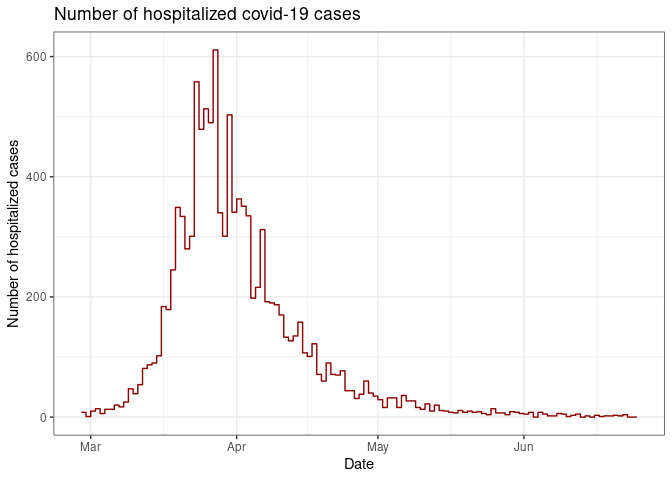
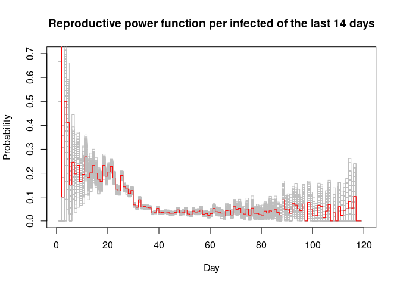
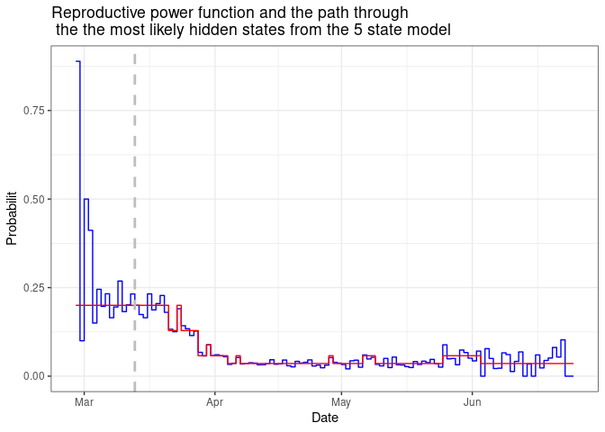
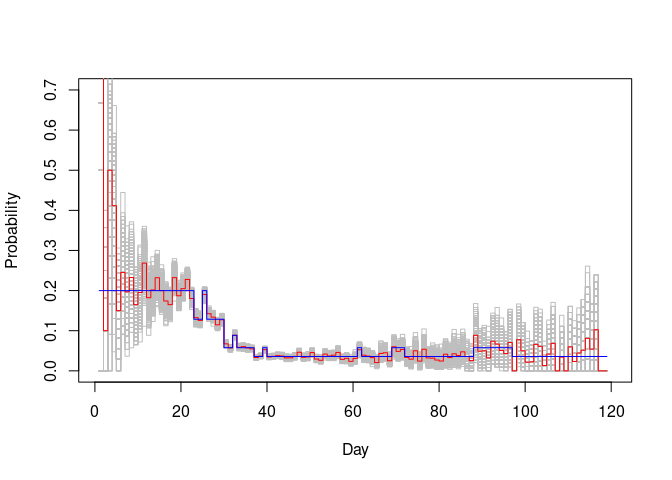

Covid-19 hospitalizations per day
================

# The data

The data is taken from the website of the RIVM:
<https://www.rivm.nl/coronavirus-covid-19/grafieken>.

The figure below shows the daily number of hospitalized covid-19 cases
from 2020/2/27 until 2020/6/25

<!-- -->

The reproductive power function is calculated conditional on the number
of infected in the previous 14 days. So the reproductive power function
can be seen as the probability that an infected from the 14 previous
days, produces a new on.

The estimated reproductive power function is:

<!-- -->

The beginning is quite messy since the conditioning is on less than 14
days. Since after day 60 the number of hospitalization decreases the
number of infected in the previous 14 days also decrease leading to an
increase of uncertainty. The gray lines are 1000 parametric bootstrap
lines to show the uncertainty and the increase of towards the end of the
series.

# A Markov-switching model

Models with 2 until 9 states were fitted to the data.

The model with 5 states fitted the data best according to Akaike’s
Information Criterion (AIC).

In the figure below the reproductive power function (blue line) and the
path through the the most likely hidden states from the 5 state model
(red line) are shown. As can be seen the estimated states follow the
reproductive power function quit accurately. That this number of states
is needed might be due to the volatility in the time series. However
this model might also overfit the data.

<!-- -->

In the figure below the decoded path for the 5-state model is shown
again (blue line). Besides some going-up and going-down in this path one
might roughly recognize 4 periods. So the decoded path for the 5-state
model is also calculated and shown in the figure below (red line). The
gray vertical line indicates the first 14 days.

The 5 state levels are: state 1 with a level of 0.20, state 2 with a
level of 0.13, state 3 with a level of 0.09, state 4 with a level of
0.06 and state 5 with a level of 0.04.

Using the 5-state model one might come up withe the following periods:

28-2 until 23-3: outbreak state with state level 1;

24-3 until 6-4: switching between state 2, 3 and 4.

7-4 until 24-5: mostly state 5

25-5 until 2-6: mostly state 4

2-6 until the end: state 5

The figure below shows the reproductive power function with the
uncertainty (parametric bootstrap lines) and the most likely state
probability path from the 5 state model.

<!-- -->
